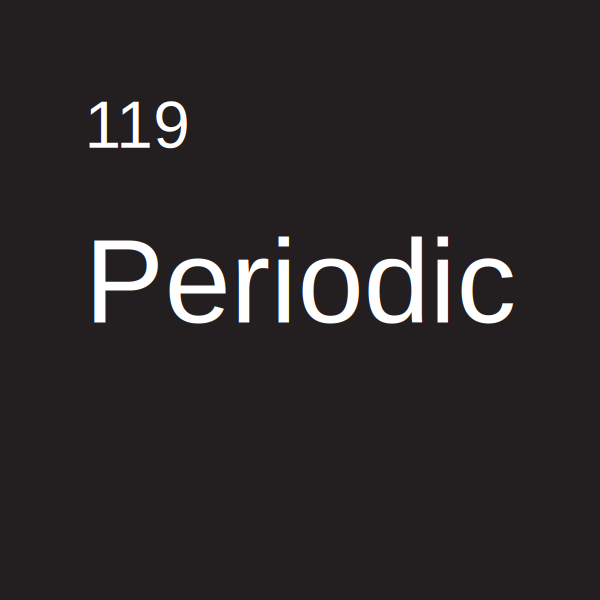
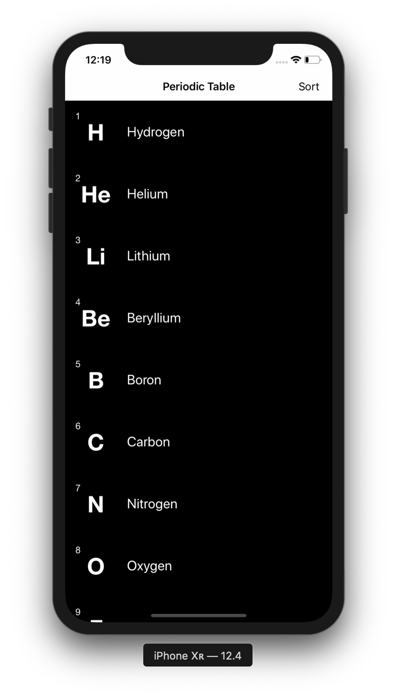
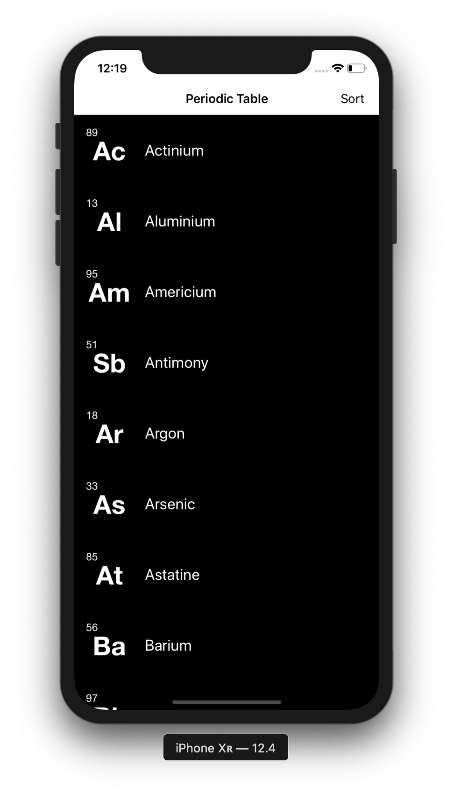
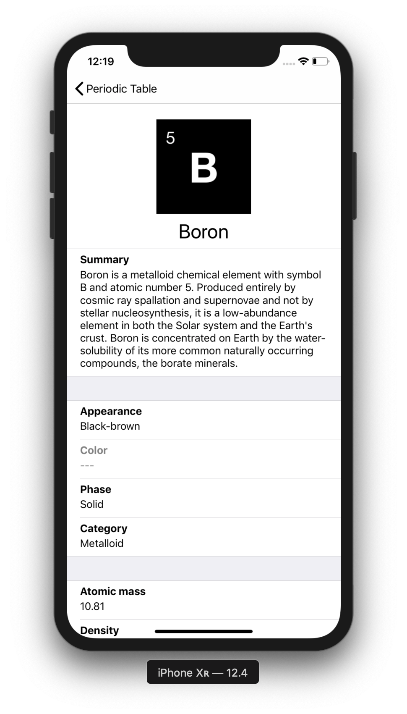
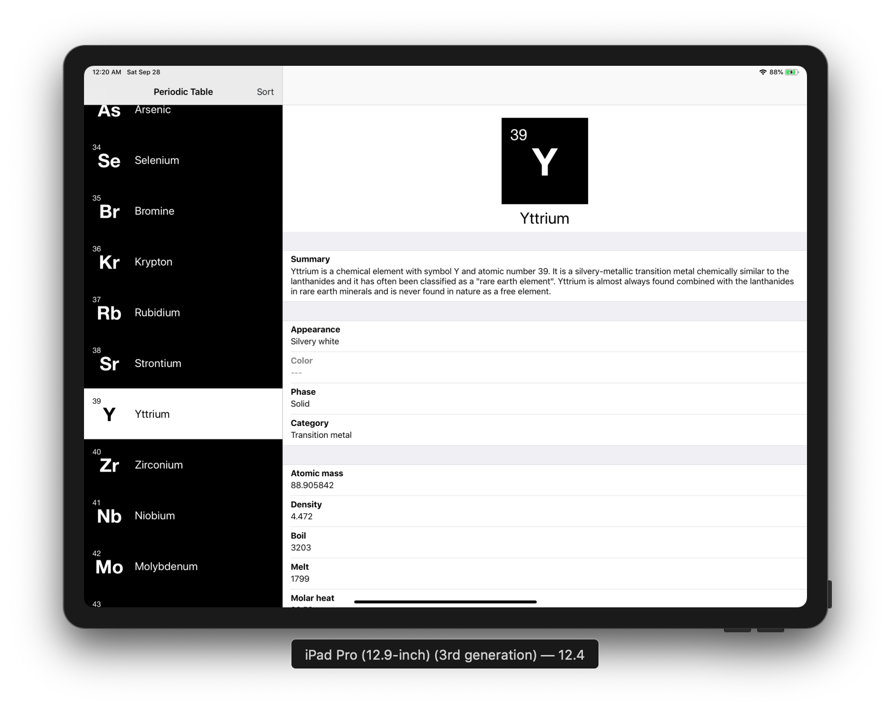

# Periodic Table

List of 119 elements in the periodic table

## Getting Started

Clone the project to where you want to have it on your local machine and run it with Xcode

## Quick Look

#### Listing

#### Sort by name
 

#### Detail view

#### Side by side view on iPad

## Versions

* **Version 1.0:** 

## Author

* [**Nhan Cao**](https://www.linkedin.com/in/nhan-cao/)
